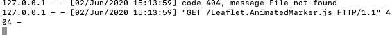
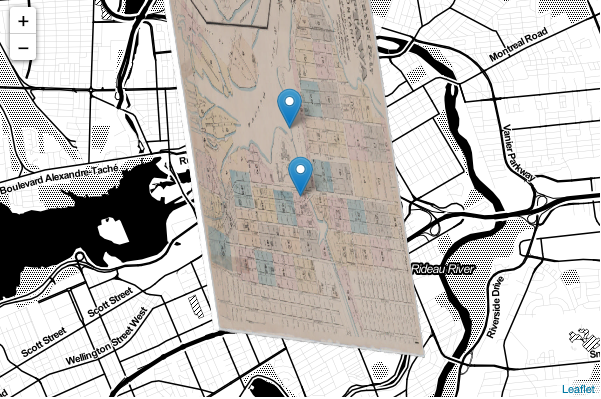
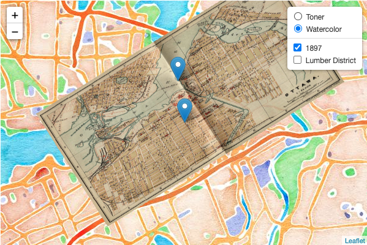
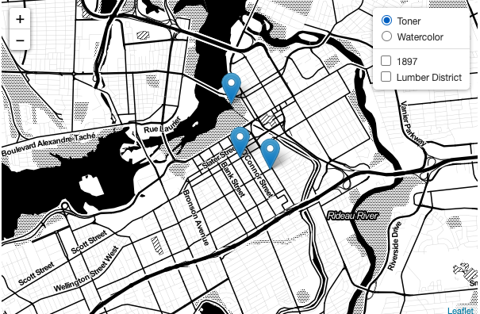
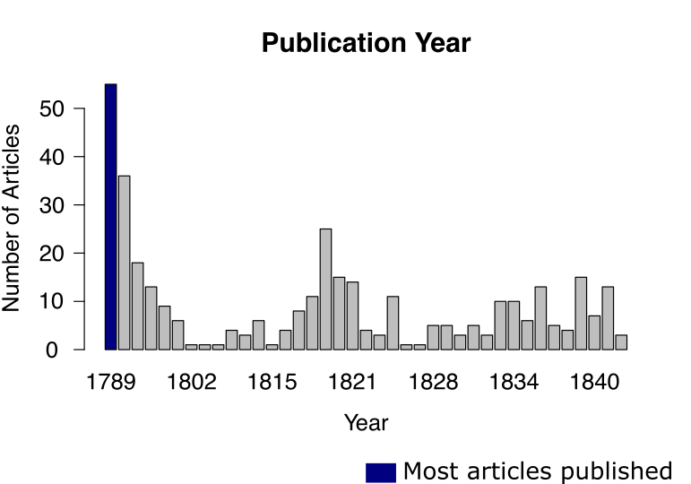
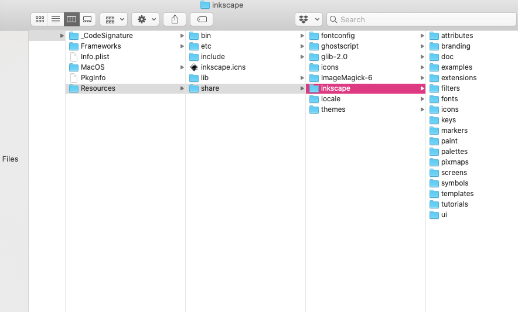

# Week Five Notes

## Sonification
- Sonification: visualization of historical data auditorially to achieve a particular sensory effect [source](http://songsoftheottawa.ca/index.html)
- used Two Tone's sample data, Honey production in the USA (1998-2012) to familiarize myself with the program
- different tones stand out more when you listen to them than others
  - ex. the piano is more noticable than the bass when played simultaneously because the bass has a lower tone
- when using the archaeological data, the program displays the qualitative data (where the materials were found) on the bottom
  - the duration of the song co-incides with the place where the materials were found
  - each new beat is actually a different place
  - could help us see patterns in the change of the number of coins as it gets further along in the song
- lowered the volume of the count of other Roman materials because I wanted to notice when coins were found
  - I set it to 90% volume while the other stayed at 100%
  - also set the instrument for count of other Roman materials to piano and count of coins to trumpet
  - different intruments, volume settings, and sounds could change what the listener hears, thus changing the meaning of the song
  
I uploaded the mp3 file into my repo, which can be found [here](https://github.com/paula-rodrigo/week-five/blob/master/sonification-roman-data.mp3)

## Mapping
### StoryMaps
- didn't have any location-based research in mind at first, so I just mapped a theoretical road trip I would have from my hometown to Ottawa
- [here](https://uploads.knightlab.com/storymapjs/bf5a196c6852db101445a82dee4321d5/story-map/index.html) is the link to my map
- really cool tool for showing narrative
  - could be useful for biographies or tracking the movement of materials
### web maps
- [open source map](http://revolt.axismaps.com/map/) made using leaflet.js
  - map is in the style of the maps from the time period
  - shows the movement of the battles, who was attacking from where, how they had to transport troops/resources
  - gives context and explanation on the side
- mapping with Leaflet
  - no errors with the initial map and python
  - tried adding more data using the instructions from [this link](https://subscription.packtpub.com/book/web_development/9781783554812/1/ch01lvl1sec12/adding-data-to-your-map#:~:text=You%20can%20create%20a%20marker,interact%20with%20it%20by%20name), but the instructions didn't work
   - after looking for other instructions and some experimentation (like adding "features" to point-data.geojson), I still didn't find a method that worked
    - I'll have to look for another way the next time I try to make a web map
  - error when adding animation
  
  - after looking up the error message and reading the answers on [this website](https://stackoverflow.com/questions/25490653/simplehttpserver-error-404-get-d3-d3-v3-js-http-1-1-404), I realized that I labeled my .js file incorrectly
  - fixed the misspelling and it ran perfectly
  - original map: 
  - map with new layer: 
  - map with layer control button: 
  - map with animation: 

From [this reading](http://www.themacroscope.org/?page_id=875): cartography is as much of an art as it is a science
- there can be many ways to map something
- each map can argue something different, even if it is depicting the same place as another

## Posters
- academic posters and infographics
- from [this reading](http://www.themacroscope.org/?page_id=875):
  - information visualization: mapping of abstract data to graphic variables to make a visual representation
  - static visualizations: do not move and cannot be manipulated
  - dynamic visualizations: short animations which show change, either over time or across some other variable
  - interactive visualizations: allow the user to manipulate the graphical variables themselves in real-time
  - need balance between clarity and flexibility
- succesfully edited and coloured this graph with Inkscape:

- I've used editing programs like Photoshop and Pixelmator before, so this is something I'm used to doing
- had trouble uploading a custom colour palette, but then I realized that the "palettes" folder was not in the place that the tutorial said it would be:

  - after finding the correct path, everything worked and I was able to upload my palette
- my dad is colourblind, so I know how important it is that graphics have colours that are easy to understand, especially if those graphics are supposed to teach or argue something
- I've learned about the rule of thirds, the golden ratio, and colour theory before in previous art classes but I never gave too much thought about how to pair fonts
  - things to think about: height of letters, width, curves, thickness

- resources:
  - [colorbrewer](https://colorbrewer2.org/#type=sequential&scheme=BuGn&n=3)
  - [typeconnection.com](http://www.typeconnection.com/)

## static site
- [here](https://paula-rodrigo.github.io/) is the link to my static site for this class
- I've used other site-building platforms before, but have never made a static site using github
- easier than I expected
- used the [github tutorial](https://help.github.com/en/github/working-with-github-pages/creating-a-github-pages-site) to create my own webpage
- I used [this page](https://help.github.com/en/enterprise/2.14/user/articles/customizing-css-and-html-in-your-jekyll-theme) to figure out which parts of the original theme code I needed to have to change parts of the preset theme that I chose
  - downloaded the .scss file for the theme in my repo
- I wanted to change visual elements of my site, so I used these links to help me figure out how to edit the code:
  - [to change background colour](https://github.com/onivim/oni/issues/1708)
  - [to customize the link hover](https://www.w3schools.com/cssref/sel_hover.asp)
  - [to outline the title text](https://www.codesdope.com/blog/article/adding-outline-to-text-using-css/)
- really enjoyed the creativity I had to customize the site
- wondering if I could even make my own github website theme in the future
- after this exercise, I think websites should be pleasing to the eye, easy to navigate (user-friendly), and visually relevant to what it is about
